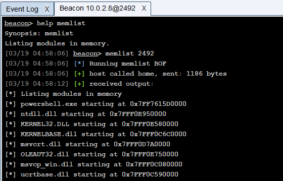

# Memlist BOF

This repository contains the source code of a simple Beacon Object File (BOF) for Cobalt Strike that I wrote during my learning process. It allows an operator to list the modules loaded in memory for a specified process on a Windows system. 

# How it works

- The code defines a function called **ListModules** that takes a process ID as input and uses the Windows API function **CreateToolhelp32Snapshot** to create a snapshot of the specified process.

- The function then uses the Windows API functions **Module32First** and **Module32Next** to iterate through the modules in the snapshot and print their names and base addresses to the console using the Cobalt Strike **BeaconPrintf** and **BeaconFormatPrintf** functions.

- The **go** function is the main function that Cobalt Strike calls when the Beacon Object File is loaded. It takes a buffer of data as input and parses it using the **BeaconDataParse** function. 

- The process ID is extracted from the parsed data using **BeaconDataInt** and passed to the **ListModules** function to list the loaded modules. Finally, the function returns 0 to indicate success.

Note: Without specifying the process ID, this BOF will simply list modules in beacon's process itself.

# How to use

- Compile this with x64 MinGW:

```
x86_64-w64-mingw32-gcc -c memlist.c -o memlist.x64.o
```

- Load the Aggressor (.cna) script into Cobalt Strike using the script manager

- Use the **memlist** command from your Beacon Console.

```
beacon> help memlist
Synopsis: memlist
Listing modules in memory.
[03/19 04:58:06] beacon> memlist 2492
[03/19 04:58:06] [*] Running memlist BOF
[03/19 04:58:06] [+] host called home, sent: 1186 bytes
[03/19 04:58:12] [+] received output:
[*] Listing modules in memory
[*] powershell.exe starting at 0x7FF7615D0000
[*] ntdll.dll starting at 0x7FFF0E950000
[*] KERNEL32.DLL starting at 0x7FFF0E580000
[*] KERNELBASE.dll starting at 0x7FFF0C6C0000
[*] msvcrt.dll starting at 0x7FFF0D7A0000
[*] OLEAUT32.dll starting at 0x7FFF0E750000
[*] msvcp_win.dll starting at 0x7FFF0C080000
```

